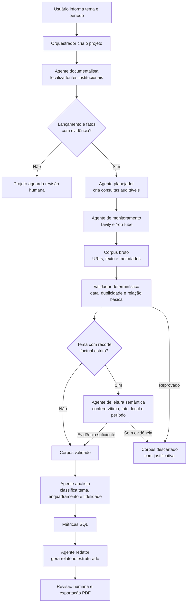

# Relatório de Repercussão Midiática — ISP

Aplicação para produzir relatórios auditáveis sobre a repercussão de temas e produtos do Instituto de Segurança Pública (ISP). O sistema preserva o documento-base, as consultas, os resultados aceitos e descartados, as evidências, as classificações e as métricas em camadas separadas.

## O que a aplicação entrega

- Descoberta de fontes institucionais e extração de fatos de referência.
- Planejamento de consultas, coleta em fontes abertas e no YouTube.
- Corpus auditável: cada item mantém URL, consulta de origem, evidência, status e motivo de descarte.
- Validação por data, relação com o tema e, quando o tema exige, leitura semântica do conteúdo.
- Métricas SQL, relatório estruturado e exportação em PDF.
- Histórico de relatórios, com exclusão por tema e dia de geração.

## Subir o banco

```powershell
Copy-Item .env.example .env
docker compose up -d
docker compose ps
```

O PostgreSQL estará em `localhost:5432`, banco `repercussao`. A senha padrão é apenas para desenvolvimento local; altere-a antes de qualquer ambiente compartilhado.

## Rodar toda a aplicação no Docker

```powershell
Copy-Item .env.example .env
docker compose up -d --build
docker compose ps
```

A API estará em `http://127.0.0.1:8000/docs`. O diretório do projeto fica espelhado em `/app` no contêiner: alterações em arquivos `.py` e no `.env` acionam recarga automática da API. Não é necessário reconstruir a imagem para essas alterações.

Observação: mudanças no próprio `docker-compose.yml`, `Dockerfile` ou em dependências de `requirements.txt` exigem `docker compose up -d --build`.

## Rodar a API fora do Docker

```powershell
py -m venv .venv
.\.venv\Scripts\Activate.ps1
pip install -r requirements.txt
uvicorn app.main:app --reload
```

Abra `http://127.0.0.1:8000/docs` para testar a API. Fora do Docker, altere no `.env` o host da URL de banco de `postgres` para `localhost`. Para busca real, informe `TAVILY_API_KEY` no arquivo `.env`. Sem chave, o planejamento e a inserção manual de evidências continuam funcionando.

### Provedor de IA

Por padrão, a aplicação usa OpenAI:

```dotenv
LLM_PROVIDER=openai
OPENAI_API_KEY=sua_chave
OPENAI_MODEL=gpt-4.1-mini
```

Para usar Groq como alternativa, defina as variáveis abaixo no `.env` local. A chave não deve ser incluída em arquivos versionados:

```dotenv
LLM_PROVIDER=groq
GROQ_API_KEY=sua_chave
GROQ_MODEL=openai/gpt-oss-120b
```

`openai/gpt-oss-120b` é a configuração recomendada para planejamento, análise semântica e redação. Para triagem de grande volume com menor custo, use `openai/gpt-oss-20b` apenas após validar a qualidade das respostas no seu corpus.

## Fluxo dos agentes



### Etapas operacionais

1. `POST /projects` recebe o tema, pesquisa fontes institucionais e tenta confirmar instituição, lançamento e fatos. A série histórica é configurada do lançamento confirmado até o dia atual.
2. `POST /projects/{id}/official-facts` registra fatos extraídos do documento oficial, com página e evidência.
3. `POST /projects/{id}/plan-searches` ou `POST /projects/{id}/ai/plan-searches` cria consultas auditáveis.
4. `POST /projects/{id}/collect` usa Tavily e a execução completa também consulta o YouTube quando a chave estiver configurada.
5. `POST /projects/{id}/validate-and-classify` aplica as regras de data e aderência. Em recortes factuais estritos, candidatos passam por leitura semântica estruturada e precisam apresentar evidência explícita no texto.
6. `GET /projects/{id}/metrics` retorna indicadores calculados por SQL a partir do corpus validado.
7. `GET /projects/{id}/ai/report` redige o relatório com métricas e evidências já aprovadas; `GET /projects/{id}/export.pdf` gera a versão para download.

O fluxo completo da interface usa `POST /projects/{id}/run`, que coordena perfil documental, planejamento, coleta, validação e redação.

Se a data de lançamento não vier acompanhada de evidência suficiente, o projeto fica como `PROFILE_NEEDS_REVIEW`: o sistema não afirma uma data inventada e a janela deve ser revisada antes da coleta.

Os fatos e seus URLs de origem podem ser auditados em `GET /projects/{id}/official-facts`.

## Recursos de IA (OpenAI)

- `POST /projects/{id}/ai/plan-searches` cria consultas a partir dos fatos oficiais.
- `POST /projects/{id}/ai/classify` analisa somente itens já validados.
- `GET /projects/{id}/ai/report` redige a partir de métricas SQL e evidências validadas, seguindo a estrutura: resumo executivo, oito seções analíticas, nota metodológica e corpus auditável.

Para temas que pedem um fato específico — por exemplo, morte de policial em um local e período determinados — a aplicação usa uma revisão semântica adicional. A decisão só é aceita quando a leitura estruturada e a evidência textual concordam sobre vítima, fato, local e período. Isso evita que uma matéria sobre morte de civil, outro estado ou outra data entre no corpus apenas por conter palavras parecidas.

Esses endpoints não habilitam ferramentas para a LLM: ela não consulta a web, não acessa o banco e não altera registros fora das consultas ou classificações solicitadas. As respostas estruturadas são solicitadas em JSON e não são armazenadas pela API da OpenAI (`store=False`).

## Princípios institucionais

- Tavily descobre fontes; não decide o que é válido.
- O redator não acessa a web: trabalha em cima de corpus congelado e métricas SQL.
- Ausência de resultado não é prova de ausência de cobertura.
- Cada registro preserva consulta de origem, URL, evidência, status e motivo de descarte.
- O histórico agrupa revisões por tema e dia. Ao excluir um item, todas as revisões daquele tema naquele dia são removidas junto com seus dados associados.
- A aprovação humana deve ocorrer após o documento-base, após o corpus e antes da publicação.

Os prompts de cada papel estão versionados em `app/prompts.py`. Eles foram desenhados para receber somente o contexto necessário a cada etapa; o agente redator, por exemplo, não recebe ferramentas de busca.
