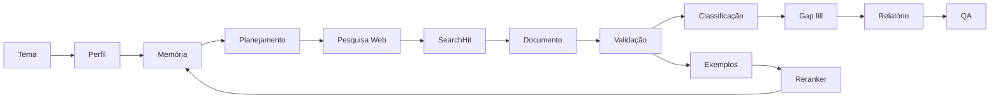

# Recuperação Semântica e Aprendizado Incremental para Análise Auditável de Repercussão Midiática

**Jefferson Anjos**  
*Instituto de Segurança Pública do Estado do Rio de Janeiro / Programa de Pós-Graduação em Ciência da Computação*  

> **Manuscrito em desenvolvimento.** Este documento separa resultados já observáveis no protótipo de hipóteses que ainda dependem de avaliação experimental. Valores de Precision, Recall, F1, custo e redução de buscas não são apresentados antes da construção e anotação do benchmark.

## Resumo

A análise automatizada de repercussão midiática envolve dois problemas distintos: recuperar conteúdo potencialmente relacionado a um tema e decidir quais documentos efetivamente constituem cobertura relevante para o objeto monitorado. Estratégias baseadas exclusivamente em palavras-chave tendem a produzir redundância, falsos positivos e repetição de buscas já realizadas, enquanto o uso direto de modelos de linguagem pode dificultar a reprodução e a auditoria das decisões. Este trabalho apresenta uma arquitetura híbrida para análise de repercussão midiática que combina planejamento estruturado de consultas, recuperação Web, regras determinísticas, modelos de linguagem, persistência de proveniência, memória global de corpus, embeddings e aprendizado supervisionado incremental. O método preserva separadamente resultados brutos, documentos consolidados, evidências factuais e decisões de relevância. Documentos coletados em pesquisas anteriores podem ser recuperados semanticamente em novos projetos, mas são revalidados em relação ao novo tema. As decisões VALID e NOT_RELATED formam progressivamente um conjunto de treinamento utilizado por um reranker local, cuja função é priorizar candidatos sem substituir a validação final. O protótipo encontra-se implementado como aplicação FastAPI com persistência relacional e geração auditável de relatórios. Propõe-se um protocolo experimental baseado em quatro questões de pesquisa para avaliar qualidade de recuperação, benefício da memória histórica, contribuição de cada componente do ranking e redução de custo computacional. A arquitetura estabelece, adicionalmente, a base para experimentos futuros de aprendizado federado entre instituições que não possam compartilhar seus corpora textuais.

**Palavras-chave:** recuperação de informação; repercussão midiática; modelos de linguagem; RAG; aprendizado incremental; proveniência; auditabilidade; segurança pública.

---

## 1. Introdução

Monitorar a repercussão midiática de um tema não equivale a pesquisar documentos que contenham uma expressão. O problema exige identificar um objeto de análise, estabelecer uma janela temporal, recuperar candidatos, distinguir evidência factual de cobertura jornalística, eliminar duplicações e decidir se cada item possui relação material com o tema.

Essa distinção é relevante em segurança pública. Uma página institucional pode comprovar um fato sem constituir repercussão midiática. Em sentido inverso, uma reportagem pode discutir consequências ou achados diretamente associados ao objeto monitorado sem mencionar literalmente a instituição que originou a pesquisa. Uma metodologia baseada apenas em correspondência lexical pode, portanto, produzir simultaneamente falsos positivos e falsos negativos.

Infraestruturas como GDELT e Media Cloud demonstram a viabilidade da coleta e análise computacional de notícias em grande escala. O GDELT 2.0 mantém bases de eventos, menções e conhecimento extraído de notícias, com atualizações frequentes e suporte a análises sobre a propagação de eventos na mídia. O Media Cloud oferece infraestrutura aberta para coleta, indexação e pesquisa de notícias da Web; sua versão 2.0 reporta mais de 1,8 bilhão de histórias indexadas.

Em paralelo, abordagens de Retrieval-Augmented Generation (RAG) mostraram a utilidade de combinar modelos paramétricos com memória externa recuperável. A separação entre o modelo e uma memória não paramétrica oferece uma propriedade particularmente importante para este domínio: o conhecimento documental pode ser atualizado e sua proveniência pode ser preservada independentemente dos parâmetros do modelo.

Este trabalho propõe uma arquitetura orientada à **auditabilidade de projetos de repercussão midiática**. Em vez de tratar a saída do mecanismo de busca como corpus final ou delegar todo o processo a uma LLM, o sistema persiste a cadeia:

```text
tema
→ perfil semântico
→ consulta
→ chamada de pesquisa
→ resultado bruto
→ documento consolidado
→ validação
→ evidência
→ classificação
→ relatório
```

A contribuição adicional deste trabalho é transformar o histórico de pesquisas em memória reutilizável. O corpus textual coletado anteriormente permanece disponível para recuperação semântica, enquanto decisões dependentes do tema são armazenadas separadamente. As decisões de relevância geram exemplos supervisionados para um reranker incremental.

### 1.1 Contribuições

As principais contribuições são:

1. uma arquitetura auditável que separa fato, evidência factual e repercussão;
2. persistência do resultado bruto e da proveniência de cada documento;
3. planejamento compacto de consultas com controle de redundância;
4. memória global de corpus com deduplicação e recuperação semântica;
5. revalidação de documentos históricos em novos contextos;
6. geração automática de exemplos supervisionados a partir das decisões do pipeline;
7. reranker incremental que prioriza candidatos sem substituir a validação final;
8. protocolo experimental para medir qualidade, custo e benefício do aprendizado acumulado.

---

## 2. Trabalhos relacionados

### 2.1 Monitoramento computacional de notícias

O GDELT constitui uma infraestrutura global para análise de eventos e narrativas extraídas da mídia. No GDELT 2.0, a tabela de menções permite registrar múltiplas referências jornalísticas ao mesmo evento, tornando possível observar sua propagação entre veículos. A infraestrutura também inclui o Global Knowledge Graph, com entidades, temas, localizações e outras dimensões extraídas dos documentos.

A proposta deste trabalho difere em escala e finalidade. O objetivo não é construir um catálogo mundial de eventos, mas manter a trilha metodológica de uma investigação temática delimitada, incluindo itens posteriormente rejeitados.

Roberts et al. (2021) descrevem o Media Cloud como uma plataforma open source para coleta e estudo do ecossistema de mídia na Web. Bermejo et al. (2026) apresentam sua reengenharia, incluindo novo sistema de coleta, armazenamento, recuperação e índice pesquisável de notícias. Esses trabalhos demonstram a importância de infraestrutura de corpus para estudos de mídia.

O presente sistema compartilha a preocupação com corpus e recuperação, porém acrescenta uma camada orientada à decisão: cada documento é avaliado em relação a um objeto de monitoramento e essa decisão permanece vinculada ao projeto que a originou.

### 2.2 Recuperação aumentada e memória externa

Lewis et al. (2020) propõem RAG como combinação entre memória paramétrica e memória não paramétrica recuperável. A arquitetura foi motivada, entre outros fatores, pelas dificuldades de atualizar conhecimento e fornecer proveniência em modelos puramente paramétricos.

Neste trabalho, a memória externa não é utilizada apenas para responder perguntas. Ela participa do próprio processo de construção do corpus. Antes de executar novas buscas, documentos históricos são recuperados e ranqueados em relação ao novo projeto.

### 2.3 Aprendizado incremental para relevância

Sistemas de recuperação frequentemente utilizam múltiplos estágios: um recuperador de maior recall produz candidatos e um reranker aplica uma função mais discriminativa. O protótipo segue esse princípio, mas utiliza como supervisão as decisões acumuladas durante sua própria operação.

Esse mecanismo deve ser diferenciado de aprendizado federado. No estágio atual existe um corpus centralizado e, portanto, o treinamento incremental pode ser realizado localmente. Aprendizado federado torna-se pertinente quando múltiplas instituições possuem dados privados independentes e desejam compartilhar atualizações de modelo sem centralizar os textos.

---

## 3. Questões de pesquisa

A avaliação é organizada pelas seguintes questões:

**RQ1 — Qual é a qualidade da seleção automática de matérias?**  
A validação híbrida consegue distinguir documentos relacionados e não relacionados com desempenho comparável à anotação humana?

**RQ2 — A memória histórica melhora a recuperação?**  
A reutilização do corpus aumenta Recall@K e reduz pesquisas externas sem degradar a precisão do corpus final?

**RQ3 — Quais componentes contribuem para o ranking?**  
Qual é o efeito isolado da similaridade lexical, embeddings e reranker supervisionado?

**RQ4 — O aprendizado acumulado reduz custo operacional?**  
À medida que o corpus e o conjunto supervisionado crescem, há redução de chamadas externas, documentos submetidos à LLM, tokens, latência e custo monetário?

Uma questão futura é:

**RQ5 — O aprendizado federado preserva desempenho quando o corpus não pode ser centralizado?**

RQ5 não pertence ao experimento inicial e deve ser avaliada apenas quando houver múltiplos nós institucionais independentes.

---

## 4. Metodologia

### 4.1 Arquitetura

O sistema é implementado em Python 3.12, FastAPI, SQLAlchemy e Pydantic. PostgreSQL é utilizado como banco principal e SQLite é suportado no desenvolvimento. A pesquisa externa utiliza DuckDuckGo; literatura científica pode ser recuperada no arXiv. Tarefas semânticas são executadas por um agente LLM com saída estruturada.



### 4.2 Tipos de projeto

O perfil distingue:

- `INSTITUTIONAL_PRODUCT`: produto institucional, como **Dossiê Mulher 2026**;
- `EVENT_TOPIC`: evento ou conjunto de eventos;
- `GENERAL_TOPIC`: pauta temática geral.

O perfil contém âncoras, variantes de pesquisa, localizações e janelas temporais utilizadas pelo planejador.

### 4.3 Planejamento de consultas

O sistema procura produzir uma consulta principal e poucas consultas complementares materialmente diferentes. Consultas muito semelhantes são descartadas antes da coleta.

#### Produto institucional

Entrada:

```text
Dossiê Mulher 2026
```

Consultas possíveis:

```text
"Dossiê Mulher 2026"
"Dossiê Mulher"
"Dossiê Mulher" "Instituto de Segurança Pública"
```

Consultas de cobertura por veículo podem assumir a forma:

```text
site:g1.globo.com "Dossiê Mulher 2026"
site:oglobo.globo.com "Dossiê Mulher 2026"
site:odia.ig.com.br "Dossiê Mulher 2026"
```

#### Evento

Entrada:

```text
morte por intervenção de agente do Estado no RJ 2026
```

Variantes implementadas pelo perfil incluem:

```text
"morte por intervenção de agente do Estado" "Rio de Janeiro" 2026
"mortes por intervenção de agentes do Estado" "Rio de Janeiro" 2026
"morte decorrente de intervenção policial" "Rio de Janeiro" 2026
"mortes decorrentes de intervenção policial" "Rio de Janeiro" 2026
```

A descoberta factual pode empregar formulações como:

```text
"morto em intervenção policial" "Rio de Janeiro" 2026
"morto durante ação policial" "Rio de Janeiro" 2026
```

#### Acompanhamento nominal

Em uma pesquisa como:

```text
policiais mortos em agosto de 2026 no Rio de Janeiro
```

a primeira passagem pode identificar nomes. Cada entidade confirmada pode originar uma consulta nominal posterior, mantendo a finalidade `NOMINAL_FOLLOWUP`.

### 4.4 Finalidade e auditoria

As consultas são classificadas como:

```text
MEDIA_REPERCUSSION
FACT_DISCOVERY
OFFICIAL_FACT
NOMINAL_FOLLOWUP
```

`SearchQuery` armazena a consulta planejada. Cada tentativa efetiva gera um `SearchCall`. Os resultados retornados são preservados como `SearchHit` antes da filtragem.

Essa modelagem permite distinguir uma busca não executada de uma busca executada sem resultados ou de uma busca que falhou.

### 4.5 Construção do corpus

URLs recuperadas são normalizadas e consolidadas em `MediaItem`. O sistema tenta recuperar o corpo integral do artigo antes da validação. A origem é classificada como portal de notícias, rede social ou YouTube.

O corpus final não é definido pela existência do resultado na busca. O resultado passa por regras temporais, deduplicação e decisão semântica de relevância.

### 4.6 Memória documental

Documentos persistentes são representados por `CorpusDocument`. Um documento pode ser associado a múltiplos projetos através de `ProjectCorpusLink`.

```text
CorpusDocument
      ↑
 ┌────┼────┐
 A    B    C
```

A separação é metodologicamente necessária: o documento é compartilhável, mas sua relação com o tema não é.

A deduplicação utiliza URL canônica, hash e fingerprint de conteúdo.

### 4.7 Representação semântica

O texto do projeto e dos documentos pode ser representado por embeddings. A configuração padrão utiliza `text-embedding-3-small`; quando o serviço de embeddings não está disponível, existe representação vetorial local determinística.

O score de recuperação histórica é uma combinação ponderada de sinais:

```math
S(d,q) = w_p P(d,q) + w_l L(d,q) + w_e E(d,q) + w_r R(d,q)
```

onde:

- (P) representa proximidade entre projetos;
- (L) representa similaridade lexical;
- (E) representa similaridade vetorial;
- (R) representa o score do reranker.

Os pesos são parâmetros do sistema e devem ser avaliados experimentalmente.

### 4.8 Aprendizado incremental

Ao final da validação, decisões positivas e negativas são convertidas em `RelevanceTrainingExample`. O exemplo contém a representação textual da consulta/projeto, o texto do documento, o rótulo e metadados da decisão.

Quando existe quantidade mínima de exemplos positivos e negativos, o reranker é treinado. Novos exemplos podem provocar retreinamento após um delta configurável.

Importante: o reranker altera a **ordem** em que documentos históricos são considerados, não a decisão final de inclusão.

### 4.9 Geração e QA

Somente documentos validados alimentam métricas e redação. O relatório é persistido em versões e submetido a QA. Achados bloqueadores podem gerar uma nova rodada de redação. O PDF final é liberado apenas quando o estado de QA permite sua exportação.

---

## 5. Desenho experimental

### 5.1 Construção do benchmark

Recomenda-se construir um benchmark estratificado por tipo de pauta:

| Estrato | Exemplos de pauta |
|---|---|
| Produto institucional | Dossiê Mulher |
| Evento delimitado | mortes de policiais em determinado período |
| Indicador/fenômeno | mortes por intervenção de agente do Estado |
| Tema emergente | uso de drones por facções criminosas |
| Tema geral | segurança pública no Rio de Janeiro |

Para cada tema devem ser preservados tanto resultados aceitos quanto rejeitados.

### 5.2 Anotação humana

Cada par ((tema, documento)) deve ser avaliado independentemente por pelo menos dois anotadores.

Rótulo primário:

```text
RELATED
NOT_RELATED
UNCERTAIN
```

Para `RELATED`, pode-se adicionar uma categoria de relação compatível com o sistema, por exemplo cobertura direta, achado atribuído ou cobertura derivada.

Divergências devem ser resolvidas por adjudicação. Recomenda-se calcular Cohen's kappa para dois anotadores ou Fleiss' kappa quando houver mais avaliadores.

### 5.3 Particionamento temporal

Como o sistema aprende ao longo do uso, um split aleatório pode produzir vazamento de informação. O experimento principal deve utilizar divisão temporal:

```text
TREINO       → projetos mais antigos
VALIDAÇÃO    → período intermediário
TESTE        → projetos posteriores
```

Documentos duplicados ou versões da mesma matéria não devem aparecer simultaneamente em treino e teste.

### 5.4 Métricas

Para RQ1:

- Precision;
- Recall;
- F1;
- especificidade;
- matriz de confusão.

Para RQ2 e RQ3:

- Recall@K;
- Precision@K;
- Mean Reciprocal Rank (MRR);
- nDCG@K.

Para RQ4:

- número de consultas externas;
- número de resultados novos;
- proporção de documentos reutilizados;
- número de documentos enviados à LLM;
- tokens de entrada e saída;
- custo monetário;
- latência total;
- custo por documento válido.

### 5.5 Baselines

O sistema deve ser comparado com pelo menos:

**B0 — Busca lexical sem memória**  
Pesquisa externa e correspondência lexical, sem corpus histórico.

**B1 — Memória lexical**  
Corpus histórico + similaridade lexical.

**B2 — Memória + embeddings**  
Corpus histórico + lexical + similaridade vetorial.

**B3 — Memória + embeddings + reranker**  
Arquitetura completa de recuperação.

**B4 — Arquitetura completa + validação LLM**  
Pipeline operacional completo.

Essa separação permite observar se um ganho decorre da memória, do embedding, do reranker ou da validação semântica.

### 5.6 Estudo de ablação

A avaliação proposta remove um componente de cada vez:

| Experimento | Lexical | Embedding | Reranker | Revalidação |
|---|:---:|:---:|:---:|:---:|
| A0 | ✓ |  |  | ✓ |
| A1 | ✓ | ✓ |  | ✓ |
| A2 | ✓ |  | ✓ | ✓ |
| A3 | ✓ | ✓ | ✓ | ✓ |
| A4 | ✓ | ✓ | ✓ |  |

A4 é particularmente importante para testar a hipótese de que **reutilizar uma decisão antiga sem revalidar é arriscado**.

### 5.7 Avaliação longitudinal

Para RQ4, os projetos devem ser processados em ordem cronológica. Após cada projeto (t), registra-se:

```text
t
corpus acumulado
exemplos supervisionados acumulados
consultas externas
itens reutilizados
itens novos
tokens
custo
latência
qualidade
```

Isso permite construir curvas de aprendizado e verificar se o sistema se torna mais econômico sem perda de qualidade.

### 5.8 Testes estatísticos

Comparações pareadas entre métodos devem utilizar os mesmos temas e candidatos. Dependendo da distribuição observada, podem ser empregados teste t pareado ou Wilcoxon signed-rank para métricas agregadas por tema. Intervalos de confiança por bootstrap são recomendados para Precision, Recall, F1 e métricas de ranking.

Além da significância estatística, devem ser reportados tamanho de efeito e intervalo de confiança.

---

## 6. Resultados preliminares

No estágio atual, os resultados são de **engenharia do sistema**, não de superioridade empírica.

O protótipo implementa:

- persistência das consultas e chamadas externas;
- preservação de resultados brutos;
- separação entre busca factual e busca de repercussão;
- recuperação do corpo de artigos;
- validação semântica;
- classificação de mídia;
- memória global de documentos;
- deduplicação por URL e conteúdo;
- embeddings;
- recuperação semântica de corpus histórico;
- geração de exemplos supervisionados;
- reranker incremental;
- busca complementar baseada em lacunas;
- versionamento do relatório;
- controle de qualidade;
- exportação Web/PDF.

A arquitetura permite executar os experimentos descritos na Seção 5 sem alterar o princípio central do pipeline.

### 6.1 Resultados que ainda precisam ser medidos

Não são apresentados neste manuscrito valores inventados para:

```text
Precision
Recall
F1
MRR
nDCG
redução percentual de buscas
economia de tokens
economia financeira
ganho do reranker
concordância humana
```

Esses campos devem ser preenchidos exclusivamente após execução do benchmark.

### 6.2 Tabela preparada para os resultados

| Método | Precision | Recall | F1 | Recall@10 | nDCG@10 | Buscas externas | Custo médio |
|---|---:|---:|---:|---:|---:|---:|---:|
| B0 lexical | — | — | — | — | — | — | — |
| B1 memória lexical | — | — | — | — | — | — | — |
| B2 + embeddings | — | — | — | — | — | — | — |
| B3 + reranker | — | — | — | — | — | — | — |
| B4 pipeline completo | — | — | — | — | — | — | — |

---

## 7. Discussão

A principal hipótese arquitetural é que o histórico de pesquisa possui valor em duas dimensões diferentes.

A primeira é **memória documental**: uma notícia já coletada não precisa ser baixada e processada novamente sempre que outro projeto tratar de tema próximo.

A segunda é **memória de decisão**: julgamentos anteriores de relevância constituem exemplos supervisionados que podem melhorar a priorização futura.

Essas dimensões não devem ser confundidas. O texto de uma notícia pode ser reutilizado diretamente; sua classificação em relação a uma nova pergunta deve ser tratada como hipótese a ser reavaliada.

A arquitetura também evita considerar o modelo de linguagem como fonte. A LLM funciona como componente de interpretação e estruturação. As evidências permanecem nos documentos recuperados.

O desenho possui limitações. A cobertura depende dos índices e rankings do mecanismo externo; ausência de resultado não demonstra ausência de repercussão. Paywalls e páginas dinâmicas podem impedir hidratação completa. Os rótulos de treinamento são produzidos pelo próprio pipeline e, sem um benchmark humano, podem carregar erros sistemáticos. Por isso, o reranker não recebe autoridade de decisão final.

---

## 8. Ameaças à validade

### 8.1 Validade interna

Mudanças no mecanismo de busca, no modelo LLM ou nos prompts podem alterar resultados. Versões de modelos, configurações e datas de execução devem ser registradas.

### 8.2 Validade externa

Um benchmark concentrado no Rio de Janeiro e em segurança pública não demonstra automaticamente generalização para outros estados, países ou domínios jornalísticos.

### 8.3 Validade de construto

“Repercussão midiática” precisa ser operacionalizada antes da anotação. Anotadores devem receber definição clara sobre cobertura direta, cobertura derivada e simples coincidência temática.

### 8.4 Contaminação temporal

Uma matéria antiga pode reaparecer em novo projeto. O benchmark deve controlar duplicatas e impedir que o mesmo conteúdo seja simultaneamente exemplo de treinamento e teste.

---

## 9. Conclusão

Este trabalho apresenta um sistema de análise de repercussão midiática que combina recuperação de informação, modelos de linguagem e aprendizado incremental sob uma arquitetura orientada à auditoria.

A separação entre `SearchHit`, `MediaItem`, `CorpusDocument` e a relação projeto-documento permite preservar evidência histórica sem assumir que decisões de relevância sejam universais. A memória semântica reduz a necessidade conceitual de reiniciar cada investigação do zero, enquanto o conjunto `RelevanceTrainingExample` transforma decisões acumuladas em sinal supervisionado.

O reranker constitui o primeiro mecanismo explícito de aprendizado com o uso do sistema. Entretanto, ele permanece limitado à priorização de candidatos, preservando a validação final e a rastreabilidade.

O próximo passo científico não é adicionar mais complexidade ao modelo, mas executar o protocolo experimental proposto. A construção de um benchmark humano permitirá quantificar qualidade, ganho de recuperação, economia de buscas e efeito do aprendizado acumulado.

Em cenário posterior, com múltiplas instituições mantendo corpora independentes, a mesma camada supervisionada poderá ser investigada sob aprendizado federado, permitindo compartilhar atualizações de um modelo de relevância sem centralizar os textos jornalísticos.

---

## 10. Referências

BERMEJO, F.; BHARGAVA, R.; BUDNE, P.; GULLEY, P.; LEON, E.; MCGRADY, R.; NDULUE, E. B.; ZUCKERMAN, E. **Media Cloud 2.0: An Updated Open Web News Archive**. *Proceedings of the International AAAI Conference on Web and Social Media*, v. 20, n. 1, p. 2735–2746, 2026. DOI: 10.1609/icwsm.v20i1.42778.

LEWIS, P.; PEREZ, E.; PIKTUS, A.; PETRONI, F.; KARPUKHIN, V.; GOYAL, N.; KÜTTLER, H.; LEWIS, M.; YIH, W.; ROCKTÄSCHEL, T.; RIEDEL, S.; KIELA, D. **Retrieval-Augmented Generation for Knowledge-Intensive NLP Tasks**. *Advances in Neural Information Processing Systems*, v. 33, 2020.

ROBERTS, H.; BHARGAVA, R.; VALIUKAS, L.; et al. **Media Cloud: Massive Open Source Collection of Global News on the Open Web**. *Proceedings of the International AAAI Conference on Web and Social Media*, v. 15, n. 1, p. 1034–1045, 2021. DOI: 10.1609/icwsm.v15i1.18127.

THE GDELT PROJECT. **GDELT 2.0: Our Global World in Realtime**. 2015. Documentação do GDELT Project.

---

## Apêndice A — Registro mínimo de cada execução experimental

Para permitir reprodução, cada execução utilizada no artigo deve registrar:

```text
commit Git
data/hora
tema
janela factual
janela de repercussão
modelo LLM
modelo de embedding
configuração do reranker
consultas planejadas
consultas executadas
SearchHits
documentos reutilizados
documentos novos
decisões VALID/NOT_RELATED
tokens
custos
latência
status de QA
```

## Apêndice B — Hipóteses

**H1.** A recuperação semântica do corpus histórico aumenta Recall@K em comparação à memória puramente lexical.

**H2.** A inclusão do reranker supervisionado aumenta nDCG@K em comparação ao ranking lexical + embeddings.

**H3.** O reuso histórico reduz o número de buscas externas por projeto sem reduzir significativamente o F1 da seleção final.

**H4.** A revalidação específica por projeto apresenta menor taxa de falso positivo do que a reutilização automática de rótulos históricos.

**H5.** O custo médio por documento válido diminui conforme cresce o corpus histórico e o número de exemplos supervisionados.
